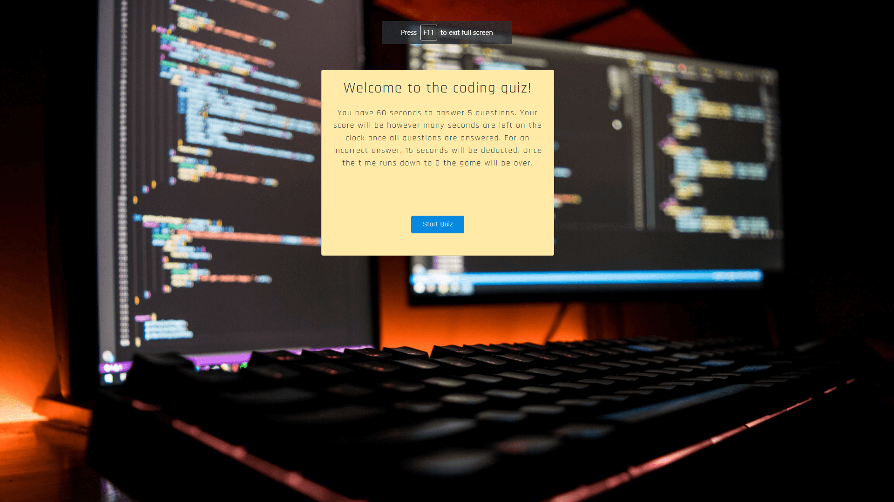
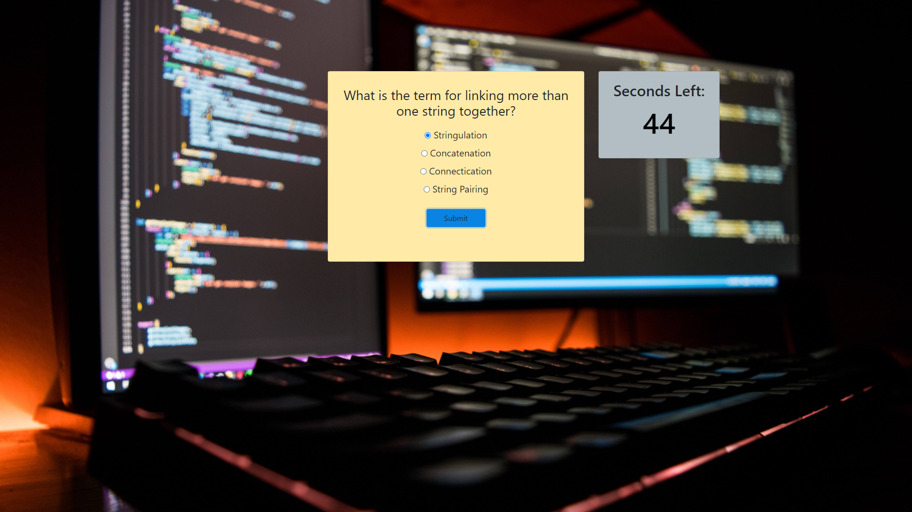
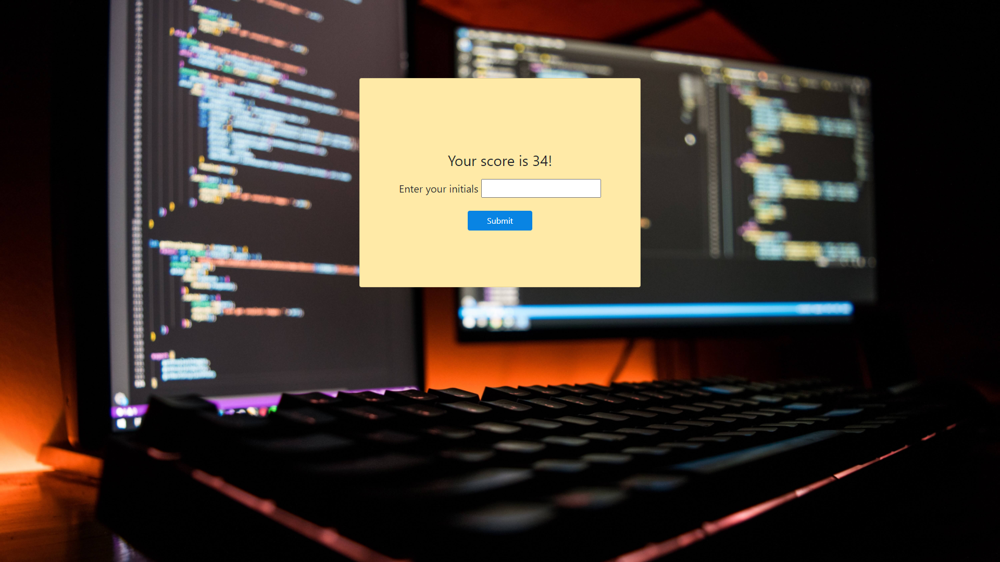

# Coding Quiz

A timed code quiz with multiple-choice questions.

<p>
    
    
    
</p>

[A deployed version can be viewed here.](https://jfisher396.github.io/coding-quiz/)

## Contents

1. [About](#about)
    1. [User Story](#user%20story)
    2. [Acceptance criteria](#acceptance%20criteria)
    3. [Visuals](#visuals)
    4. [Build](#build)
2. [Setup](#setup)
3. [Credits](#credits)
4. [License](#license)
5. [Contributing](#contributing)

## About

This app will run in the browser and feature dynamically updated HTML and CSS powered by your JavaScript code. It will also feature a clean and polished user interface and be responsive, ensuring that it adapts to multiple screen sizes.

## User Story

    AS A coding bootcamp student
    I WANT to take a timed quiz on JavaScript fundamentals that stores high scores
    SO THAT I can gauge my progress compared to my peers

## Acceptance Criteria

    GIVEN I am taking a code quiz
    WHEN I click the start button
    THEN a timer starts and I am presented with a question
    WHEN I answer a question
    THEN I am presented with another question
    WHEN I answer a question incorrectly
    THEN time is subtracted from the clock
    WHEN all questions are answered or the timer reaches 0
    THEN the game is over
    WHEN the game is over
    THEN I can save my initials and score 


## Visuals:



---

---

---


### Build

* In HTML semantic tags have been used to aid with accessibility.
* The site is built using a Bootstrap CSS framework.
   * The use of Bootstrap minimises the need for media queries. 
   * See [Bootstrap documentation](https://getbootstrap.com/docs/4.5/getting-started/introduction/) for customizing the site with their provided options.

## Setup

To clone the repo:
```
git clone git@github.com:jfisher396/coding-quiz.git
``` 

## Credits

Built by [James Fisher](https://jfisher396.github.io/james-fisher-web-developer/).

## Contact Information
* GitHub Username: jfisher396
* Email: james@james-fisher-web-developer.com
* <p>
    <a href="https://www.linkedin.com/in/jamesfisher-webdev/"></a>
    </p>

## License


[](https://opensource.org/licenses/MIT)


## Contributing

To contribute to this application, create a pull request.
Here are the steps needed for doing that:
- Fork the repo
- Create a feature branch (git checkout -b NAME-HERE)
- Commit your new feature (git commit -m 'Add some feature')
- Push your branch (git push)
- Create a new Pull Request

Following a code review, your feature will be merged.

=======
